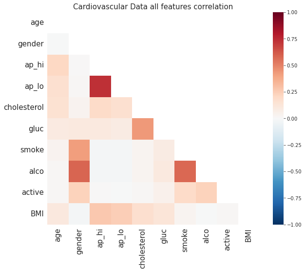
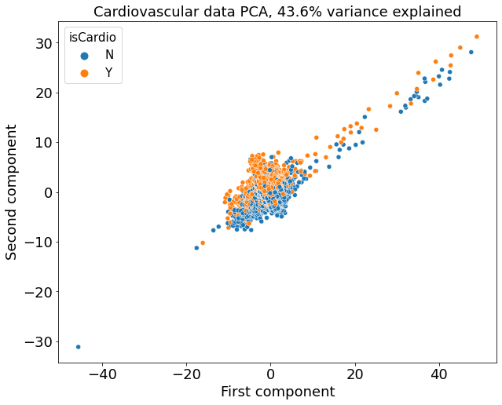
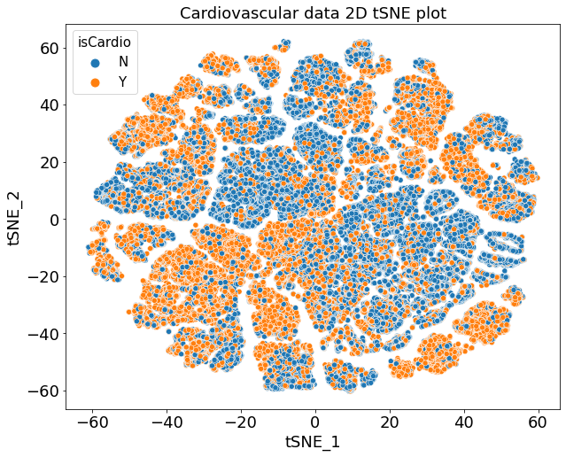
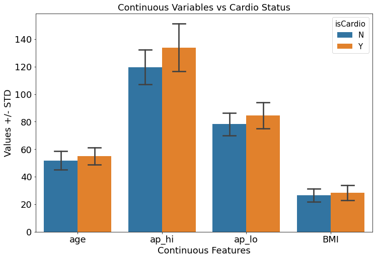
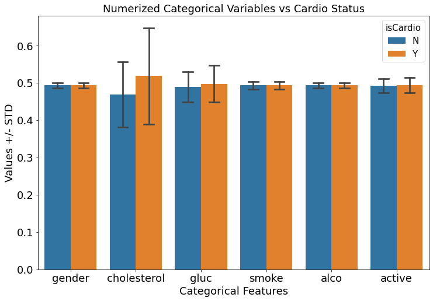

 
# Cardiovascular Disease Prediction
*
 Cardiovascular diseases (CVD) is the leading cause of death in the United States and it is estimated that 659,000 Americans die from CVD each year. The cause of CVD is complicated and risk factors that contribute to CVD are still unclear. Thus it is imperative to identify the direct indicators for cardiovascular disease in order to facilitate CVD diagnosis and treatment. In this project, I explored the relationship among a few potential cardiovascular risk factors, then checked on their predictibility against CVD through various machine learning models.
*
## 1. Data Source
I utilized Kaggle [Cardiovascular Disease Dataset](https://www.kaggle.com/sulianova/cardiovascular-disease-dataset) which contains 70,000 medical exam records of 11 potential risk factors for CVD and the diagnostic result (1: has CVD, 0: normal). Those 12 variables are Age, Height, Weight, Gender, Systolic/Diastolic blood pressures, Cholesterol levels, Glucose, Smoking, Alcohol intake and Physical activity. 

## 2. Data Wrangling
### Part 1. Indentify the hottest topics in the recent CVD research 
<b>Method:</b> I utilized the NCBI API to request all the publications between 2020 and 2021 with 'cardiovascular' in the title, scraped in total 64,801 keywords from 17,632 records, obtained frequecy of each unique keywords, grouped similar keywords through fuzzy match and visualized Top 100 most frequeny keywords with word cloud. 
<b>Result:</b>  
Based on the word cloud above, it seems latest cardiovascular researches are focused on COVID (which is obvious but not included in the Kaggle dataset), as well as hypertension, diabetes, atherosclerosis, obseity, which correspond to CVD risk factors Systolic/Diastolic blood pressures, Glucose, Cholesterol, Height/Weight, respectively. 
<b>Script:</b> {LINK TO IPYTHON NOTEBOOK} 
### Part 2. Exploration on Kaggle [Cardiovascular Disease Dataset](https://www.kaggle.com/sulianova/cardiovascular-disease-dataset) 

<b>Method:</b> 
1. Check missing values, range of each variable and correlations among features and balance of positive (1) and negative (0) labels through pandas-profiling. 
2. Filtering out records with features of abnormal values.
3. Feature engineering includes combining body and weight into a new variable BMI and applying catboost encoder to all categorical variables. 
<b>Results:</b>  
After preprocessing, the trimmed dataset shape is (68588 X 11). As shown in the heatmap above, there are no correlation among features except for a few apparent relationships: 1) Positive correlation between high (ap_hi) and low (ap_lo) blood pressures; 2) Gender bias in those who smoke or drink (likely more men than women); 3) Those who consume alcohol tend to smoke as well (Strong positive correlations) 
<b>Script:</b> {LINK TO IPYTHON NOTEBOOK} 

## 3. Exploratory Data Analysis (EDA)

<b>Method:</b> I performed PCA and t-SNE to see whether the positive (1) and negative (0) samples can be separated in 2 dimensions. In addition, I checked if any of the features are significantly different between healthy and diseased groups. 
<b>Results:</b> 
   
Both PCA and t-SNE are not able to separate normal (0) and diseased (1) samples in 2D space.  
   
High and low blood pressure (ap_hi and ap_lo) as well as cholestrol level appear to be different between normal and diseased groups. 
<b>Script:</b> {LINK TO IPYTHON NOTEBOOK} 

## 4. Data Preprocessing

<b>Method:</b> Data are preprocessing with three different methods: 
1. Obtain Catboot encoding data from data wrangling step, split train and test data, StandardScale() fit and transform on train data and transform on test data; 
2. Split train and test data from Catboot encoding data, StandardScale() plus PCA with n_component = 'mle' fit and transform on train data and transform on test data; 
3. Split train and test data from the orignal fitlered data WITHOUT catboost encoding, utilize <a href="https://www.featuretools.com/"><nobr>featuretools</nobr></a> to generate new features from the train dataset and transform on the test dataset. 
<b>Results:</b> 
Method 1 data shape: Train: (54870, 11), Test: (13718, 11) 
Method 2 data shape: Train: (54870, 9), Test: (13718, 9) 
Method 3 data shape: Train: (54870, 226), Test: (13718, 226) 
<b>Script:</b> {LINK TO IPYTHON NOTEBOOK} 

## 5. Modeling

<b>Method:</b>Each of three types of data generated from Data Preprocessing step are utlized to train the following models: 
  1. Regularized Logistic Regression; 
  2. Support Vector Machine; 
  3. Random Forest Classifier; 
  4. XGBoost Classifier; 
  5. Multilayer Perceptron Neural Network; 
  <b>Random search</b> is applied to model 1, 5, <b>Bayesian Optimization</b> is used for model 2,3,4 for hyperparameter tuning. 

<b>Results:</b> 
<b>Catboost Encoding data</b> 

| Model | Accuracy | Precision | Recall | AUC |
|---------------| -------------- | -------------- | -------------- | -------------- |
| Regularized Logistic Regression | 0.7314  | 0.7934  | 0.7125  | 0.7301  |
| Support Vector Machine | Content Cell  | Content Cell  | Content Cell  | Content Cell  |
| Random Forest Classifier | 0.7363  | 0.7884  | 0.7208 | 0.7353 |
| XGBoot Classifier | 0.7392  | 0.7893  | 0.7242  | 0.7382  |
| Multilayer Perceptron | Content Cell  | Content Cell  | Content Cell  | Content Cell  | 

                        
<b>Catboost Encoding plus PCA</b> 

| Model | Accuracy | Precision | Recall | AUC |
|---------------| -------------- | -------------- | -------------- | -------------- |
| Regularized Logistic Regression | 0.7268 | 0.7124 | 0.7417 | 0.7271 |
| Support Vector Machine | Content Cell  | Content Cell  | Content Cell  | Content Cell  |
| Random Forest Classifier | 0.7231 | 0.7591 | 0.7154 | 0.7224 |
| XGBoot Classifier | 0.7216 | 0.7458  | 0.7188  | 0.7211  |
| Multilayer Perceptron | Content Cell  | Content Cell  | Content Cell  | Content Cell  | 

                      
<b>Featuretools synthesized features</b> 

| Model | Accuracy | Precision | Recall | AUC |
|---------------| -------------- | -------------- | -------------- | -------------- |
| Regularized Logistic Regression | 0.7249  | 0.7050  | 0.7425  | 0.7253  |
| Support Vector Machine | Content Cell  | Content Cell  | Content Cell  | Content Cell  |
| Random Forest Classifier | 0.7316  | 0.7483  | 0.7316  | 0.7313  |
| XGBoot Classifier | 0.7357 | 0.8140  | 0.7102  | 0.7342 |
| Multilayer Perceptron | Content Cell  | Content Cell  | Content Cell  | Content Cell  | 
  
## 6. Conclusion
