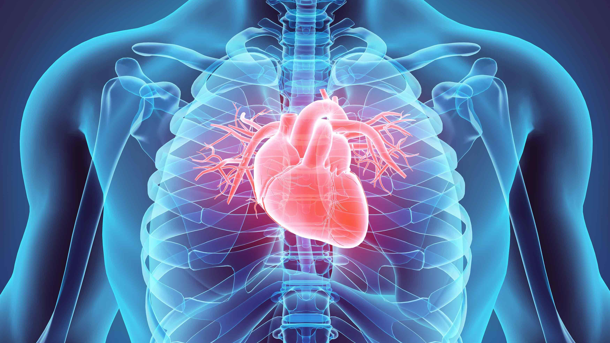

 
# Cardiovascular Disease Prediction
*
 Cardiovascular diseases (CVD) is the leading cause of death in the United States and it is estimated that 659,000 Americans die from CVD each year. The cause of CVD is complicated and risk factors that contribute to CVD are still unclear. Thus it is imperative to identify the direct indicators for cardiovascular disease in order to facilitate CVD diagnosis and treatment. In this project, I explored the relationship among a few potential cardiovascular risk factors, then checked on their predictibility against CVD through various machine learning models.
*
## 1. Data

 I utilized Kaggle [Cardiovascular Disease Dataset](https://www.kaggle.com/sulianova/cardiovascular-disease-dataset) which contains 70,000 medical exam records of 11 potential risk factors for CVD and the diagnostic result (1: has CVD, 0: normal). Those 12 variables are Age, Height, Weight, Gender, Systolic/Diastolic blood pressures, Cholesterol levels, Glucose, Smoking, Alcohol intake and Physical activity. 

